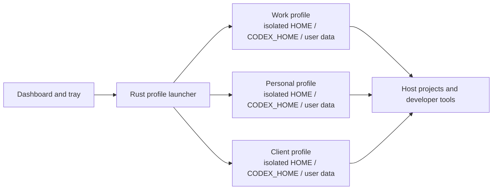

<div align="center">

# CodexManager

**Run separate Codex Desktop profiles side by side.**

Local-first session isolation, native process control, and a practical system-tray workflow — built with Tauri 2 and Rust.

[](https://github.com/tianrking/CodexManager/actions/workflows/ci.yml)
[](https://github.com/tianrking/CodexManager/releases)
[](https://tauri.app/)
[](LICENSE)

[English](README.md) · [简体中文](README_CN.md) · [Español](README_ES.md)

</div>


## Why CodexManager?

Codex Desktop normally uses one set of local application data. Signing into another account can replace that local session or collide with an already-running instance.

CodexManager gives every profile a stable, independent data directory and launches Codex with profile-specific environment variables and user data. Your projects stay on the host machine; the account session, caches, temporary files, and application state stay in the selected profile.

The two profiles created on first launch are just editable starter slots. Rename them, change their colors and project paths, or add and remove profiles as needed. Once you sign in through a slot, that login remains associated with the slot's persistent profile ID.

## Highlights

- **Independent sessions** — separate `CODEX_HOME`, application data, user data, cache, and temporary directories.
- **Concurrent windows** — run work, personal, or client profiles at the same time.
- **Windows Store support** — prepares a shared, versioned runtime copy that can be launched with isolated profile environments.
- **Interactive system tray** — left-click for the profile popover; launch or stop a profile, open the main window, stop all instances, or quit.
- **Reliable process cleanup** — stops the complete process tree that belongs to a profile.
- **Project-aware launch** — assign a default project folder or drag a folder onto a profile card.
- **Host developer access** — preserves access to the host project files and links the host Git/SSH configuration where supported.
- **Local configuration** — no manager account, no cloud database, and no telemetry added by CodexManager.
- **Polished desktop UI** — English, Simplified Chinese, and Spanish; multiple themes; editable accent and soft profile colors.

## Quick start

### Windows

1. Install the current [Codex Desktop](https://openai.com/codex/) app.
2. Download the `.msi` or `-setup.exe` package from [Releases](https://github.com/tianrking/CodexManager/releases).
3. Start CodexManager and click **Launch** on a profile.
4. Sign in to Codex in the opened window. Repeat with another profile for a second independent session.
5. Close the manager window when you are done configuring it. CodexManager stays available in the notification area.

Left-click the tray icon to open the compact profile controller. Right-click it for the native menu.

> On the first launch of a Microsoft Store installation, CodexManager copies the installed Codex runtime to a reusable location under `%USERPROFILE%\.codex_manager\runtime`. The tested Store build requires roughly 1.8 GiB of additional disk space. Profile credentials and application data are not stored in that shared runtime.

### macOS and Linux

Install or build CodexManager, start it, and launch a profile from the dashboard. CodexManager locates common Codex application paths and applies the same profile separation model.

## What is isolated?

| Data or capability | Per profile | Shared with the host |
| --- | :---: | :---: |
| Codex authentication and application state | Yes | No |
| `CODEX_HOME` | Yes | No |
| Browser/Electron user data | Yes | No |
| AppData, cache, and temporary files | Yes | No |
| Default project path | Yes | The selected host folder |
| Project files | No | Yes |
| Git configuration and SSH directory | Linked where supported | Yes |
| Windows Store runtime files | No | Shared read-only source copy |

Profile data is stored under:

```text
~/.codex_manager/
├── config.json
├── profiles/
│   └── <profile-id>/
│       ├── .codex/
│       ├── userdata/
│       ├── cache/
│       └── tmp/
└── runtime/                  # Windows Store runtime copies
```

Deleting a profile from CodexManager also removes that profile's isolated directory. This does not delete the project folder assigned to the profile.

## How it works



The launcher assigns profile-specific values for `HOME`, `CODEX_HOME`, AppData/cache directories, and `--user-data-dir`. It also disables shared keyring usage for the launched Electron process so one profile does not overwrite another profile's stored session.

On Windows, Store packages live in a protected installation directory and cannot be launched normally with the required custom environment. CodexManager discovers the installed package and prepares one versioned runtime copy. All profiles use that application runtime while retaining separate writable data directories.

To use a standalone Windows build instead, set `CODEX_DESKTOP_PATH` to the executable, installation root, or package root before starting CodexManager:

```powershell
$env:CODEX_DESKTOP_PATH = "C:\Path\To\Codex.exe"
npx tauri dev
```

## Development

### Requirements

- Node.js 20.19 or later
- Rust stable
- Platform prerequisites from the [Tauri prerequisites guide](https://v2.tauri.app/start/prerequisites/)

```bash
git clone https://github.com/tianrking/CodexManager.git
cd CodexManager
npm ci
npx tauri dev
```

Build production installers:

```bash
npm run build
npx tauri build
```

Artifacts are written below `src-tauri/target/release/bundle/`.

## Quality gates

Every push and pull request is checked on Windows, macOS, and Linux. CI runs:

```bash
npm ci
npm audit --audit-level=high
npm run build
cargo fmt --all -- --check
cargo clippy --all-targets --locked -- -D warnings
cargo check --locked
cargo test --locked --verbose
```

Tagged versions are built by the release workflow for all three desktop platforms. Dependabot monitors npm, Cargo, and GitHub Actions dependencies weekly.

## Security and limitations

- CodexManager separates local application data; it is not an operating-system sandbox.
- Launched Codex processes can access host project folders and any host resources permitted by your user account.
- Git and SSH settings are intentionally shared or linked so developer workflows continue to work.
- Anyone with access to your operating-system account may be able to read local profile data. Use full-disk encryption and a protected user account for sensitive environments.
- Platform packaging and Store internals can change. If Codex is not detected, use `CODEX_DESKTOP_PATH` and include your platform details when reporting an issue.

## Contributing

Issues and focused pull requests are welcome. Please include the operating system, Codex installation source, reproduction steps, and relevant logs for launch or process-management problems.

## License

[MIT](LICENSE) © [tianrking](https://github.com/tianrking)
