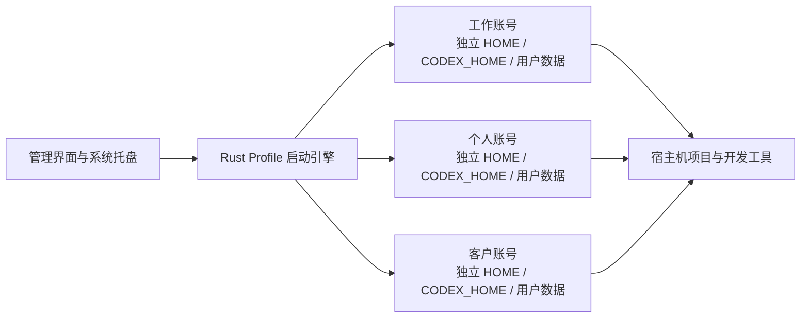

<div align="center">

# CodexManager

**让多个 Codex Desktop 账号各自独立、同时运行。**

本地优先的会话隔离、原生进程管理与实用的系统托盘交互，基于 Tauri 2 和 Rust 构建。

[](https://github.com/tianrking/CodexManager/actions/workflows/ci.yml)
[](https://github.com/tianrking/CodexManager/releases)
[](https://tauri.app/)
[](LICENSE)

[English](README.md) · [简体中文](README_CN.md) · [Español](README_ES.md)

</div>


## 为什么需要 CodexManager？

Codex Desktop 通常只使用一套本地应用数据。切换账号时，新的登录状态可能覆盖原来的会话，也可能与已经运行的实例发生冲突。

CodexManager 为每个 Profile 分配稳定、独立的数据目录，并使用该 Profile 专属的环境变量和用户数据启动 Codex。项目仍在宿主机原来的位置；账号会话、缓存、临时文件和应用状态则分别保存在对应的 Profile 中。

首次启动时出现的两个 Profile 只是便于上手的默认槽位，并不绑定任何预设账号。你可以自由改名、改颜色、设置项目路径，也可以新增或删除 Profile。通过某个槽位登录后，登录缓存会跟随其持久化 Profile ID 保存，下次仍从同一个槽位进入。

## 主要能力

- **账号会话独立**：分别保存 `CODEX_HOME`、应用数据、用户数据、缓存和临时目录。
- **多窗口并行**：工作、个人或客户账号可以同时运行。
- **兼容 Windows Store 版**：自动准备一份可由隔离环境启动、按版本复用的共享运行时。
- **交互式系统托盘**：左键打开 Profile 浮窗，可启动/停止账号、打开主窗口、全部停止或退出。
- **可靠清理进程**：按 Profile 精准识别并停止完整的主进程与子进程树。
- **按项目启动**：可以设置默认项目目录，也可以把文件夹直接拖到 Profile 卡片上。
- **保留开发环境**：Codex 仍可访问宿主机项目；在系统支持时关联宿主机 Git 与 SSH 配置。
- **配置只存本地**：CodexManager 不要求注册管理账号，不增加云端数据库，也不附带遥测。
- **完善的桌面体验**：支持英文、简体中文和西班牙语，多套主题、强调色与柔和的 Profile 配色。

## Windows 快速开始

1. 安装当前版本的 [Codex Desktop](https://openai.com/codex/)。
2. 从 [Releases](https://github.com/tianrking/CodexManager/releases) 下载 `.msi` 或 `-setup.exe` 安装包。
3. 启动 CodexManager，在一个 Profile 上点击「启动」。
4. 在打开的 Codex 窗口中登录。再启动另一个 Profile，即可登录第二个独立账号。
5. 配置完成后可以关闭管理器主窗口；程序会继续留在 Windows 通知区域。

左键单击托盘图标可打开紧凑的 Profile 控制面板；右键单击则显示原生托盘菜单。

> Microsoft Store 安装目录受到系统保护，普通程序无法直接携带隔离环境启动。因此第一次启动 Profile 时，CodexManager 会把当前 Codex 运行时复制到 `%USERPROFILE%\.codex_manager\runtime` 下并按版本复用。当前测试的 Store 版本大约需要额外 1.8 GiB 空间。账号凭据和应用数据不会写入这份共享运行时。

## macOS 与 Linux

安装或构建 CodexManager 后，从管理界面启动 Profile 即可。程序会查找常见的 Codex 应用位置，并使用相同的 Profile 隔离模型启动实例。

## 哪些内容会隔离？

| 数据或能力 | 每个 Profile 独立 | 与宿主机共享 |
| --- | :---: | :---: |
| Codex 登录状态与应用状态 | 是 | 否 |
| `CODEX_HOME` | 是 | 否 |
| Browser/Electron 用户数据 | 是 | 否 |
| AppData、缓存与临时文件 | 是 | 否 |
| 默认项目路径 | 是 | 选择的宿主机目录 |
| 项目文件 | 否 | 是 |
| Git 配置与 SSH 目录 | 在系统支持时关联 | 是 |
| Windows Store 运行时文件 | 否 | 共享只读来源副本 |

Profile 数据默认保存在：

```text
~/.codex_manager/
├── config.json
├── profiles/
│   └── <profile-id>/
│       ├── .codex/
│       ├── userdata/
│       ├── cache/
│       └── tmp/
└── runtime/                  # Windows Store 运行时副本
```

在 CodexManager 中删除 Profile 时，对应的隔离数据目录也会被删除，但不会删除为它指定的项目文件夹。

## 工作原理



启动器会为每个 Profile 设置独立的 `HOME`、`CODEX_HOME`、AppData/缓存目录和 `--user-data-dir`，并关闭该 Electron 进程对共享系统 Keyring 的依赖，避免一个 Profile 覆盖另一个 Profile 的本地会话。

Windows Store 应用位于受保护目录中，无法按普通方式携带自定义环境启动。CodexManager 会发现已安装的软件包并准备一份按版本存放的运行时副本。所有 Profile 共用应用程序文件，但使用各自独立的可写数据目录。

如果使用 Windows 独立安装版，可在启动 CodexManager 前通过 `CODEX_DESKTOP_PATH` 指定 exe、安装根目录或软件包根目录：

```powershell
$env:CODEX_DESKTOP_PATH = "C:\Path\To\Codex.exe"
npx tauri dev
```

## 本地开发

### 环境要求

- Node.js 20.19 或更高版本
- Rust stable
- [Tauri 官方文档](https://v2.tauri.app/start/prerequisites/)列出的对应平台依赖

```bash
git clone https://github.com/tianrking/CodexManager.git
cd CodexManager
npm ci
npx tauri dev
```

构建生产安装包：

```bash
npm run build
npx tauri build
```

生成物位于 `src-tauri/target/release/bundle/`。

## CI 与质量门禁

每次推送和 Pull Request 都会在 Windows、macOS、Linux 上执行：

```bash
npm ci
npm audit --audit-level=high
npm run build
cargo fmt --all -- --check
cargo clippy --all-targets --locked -- -D warnings
cargo check --locked
cargo test --locked --verbose
```

版本标签会触发三平台 Release 构建；Dependabot 每周检查 npm、Cargo 和 GitHub Actions 依赖。

## 安全边界与限制

- CodexManager 隔离的是本地应用数据，不是操作系统级沙箱。
- Codex 进程仍可访问当前系统用户有权限访问的项目目录和宿主机资源。
- 为保证正常开发，Git 与 SSH 配置会有意共享或关联。
- 能够登录当前操作系统账号的人，也可能读取本地 Profile 数据。敏感环境建议使用磁盘加密和受保护的系统账号。
- 平台打包方式与 Store 内部结构可能变化。如未能识别 Codex，可使用 `CODEX_DESKTOP_PATH`，并在提交 Issue 时附上系统版本与安装来源。

## 参与贡献

欢迎提交 Issue 和范围明确的 Pull Request。启动或进程管理问题请附上操作系统、Codex 安装来源、复现步骤与相关日志。

## 开源协议

[MIT](LICENSE) © [tianrking](https://github.com/tianrking)
