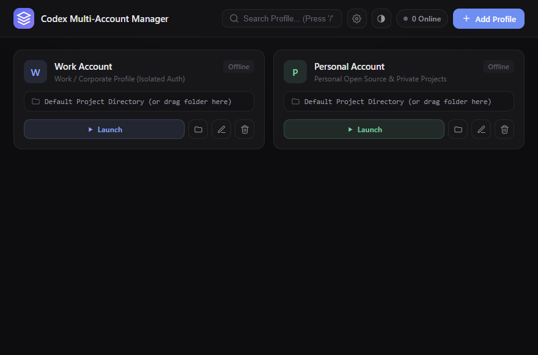

<div align="center">

# CodexManager

**Ejecuta perfiles independientes de Codex Desktop en paralelo.**

Aislamiento local de sesiones, control nativo de procesos y un flujo práctico desde la bandeja del sistema — construido con Tauri 2 y Rust.

[](https://github.com/tianrking/CodexManager/actions/workflows/ci.yml)
[](https://github.com/tianrking/CodexManager/releases)
[](https://tauri.app/)
[](LICENSE)

[English](README.md) · [简体中文](README_CN.md) · [Español](README_ES.md)

</div>



## ¿Por qué CodexManager?

Codex Desktop utiliza normalmente un único conjunto de datos locales. Iniciar sesión con otra cuenta puede reemplazar la sesión anterior o entrar en conflicto con una instancia que ya está abierta.

CodexManager asigna a cada perfil un directorio persistente e independiente, y abre Codex con variables de entorno y datos de usuario específicos. Los proyectos permanecen en el equipo anfitrión; la sesión, cachés, archivos temporales y estado de la aplicación se guardan en el perfil elegido.

Los dos perfiles iniciales son solo plantillas editables. Puedes renombrarlos, cambiar su color y ruta de proyecto, eliminarlos o crear más. Cuando inicias sesión en uno, la sesión queda asociada a su identificador persistente.

## Funciones principales

- **Sesiones independientes**: separa `CODEX_HOME`, datos de aplicación, datos de usuario, cachés y archivos temporales.
- **Ventanas simultáneas**: permite usar perfiles de trabajo, personales o de clientes a la vez.
- **Compatibilidad con Microsoft Store**: prepara una copia compartida y versionada del runtime para poder lanzarlo con entornos aislados.
- **Bandeja interactiva**: clic izquierdo para abrir el panel de perfiles; inicia o detiene perfiles, abre la ventana principal, detiene todo o cierra la aplicación.
- **Cierre fiable**: detiene el árbol completo de procesos correspondiente a un perfil.
- **Inicio por proyecto**: configura una carpeta predeterminada o arrástrala sobre una tarjeta.
- **Entorno de desarrollo conservado**: mantiene acceso a proyectos locales y enlaza Git/SSH cuando el sistema lo permite.
- **Configuración local**: sin cuenta adicional, base de datos remota ni telemetría añadida por CodexManager.
- **Interfaz cuidada**: inglés, chino simplificado y español, varios temas, color de acento y colores suaves por perfil.

## Inicio rápido en Windows

1. Instala la versión actual de [Codex Desktop](https://openai.com/codex/).
2. Descarga el paquete `.msi` o `-setup.exe` desde [Releases](https://github.com/tianrking/CodexManager/releases).
3. Abre CodexManager y pulsa **Iniciar** en un perfil.
4. Inicia sesión en la ventana de Codex. Repite el proceso en otro perfil para una segunda sesión independiente.
5. Al cerrar la ventana principal, CodexManager permanece disponible en el área de notificación.

Un clic izquierdo sobre el icono de la bandeja abre el controlador compacto. El clic derecho muestra el menú nativo.

> En el primer inicio de una instalación de Microsoft Store, CodexManager copia el runtime instalado a `%USERPROFILE%\.codex_manager\runtime` para reutilizarlo. La versión probada requiere aproximadamente 1,8 GiB adicionales. Las credenciales y datos de cada perfil no se guardan en ese runtime compartido.

## Datos aislados

| Datos o capacidad | Por perfil | Compartido con el equipo |
| --- | :---: | :---: |
| Sesión y estado de Codex | Sí | No |
| `CODEX_HOME` | Sí | No |
| Datos de Browser/Electron | Sí | No |
| AppData, cachés y temporales | Sí | No |
| Ruta de proyecto predeterminada | Sí | Carpeta seleccionada |
| Archivos del proyecto | No | Sí |
| Configuración Git y directorio SSH | Enlazados cuando es posible | Sí |
| Runtime de Microsoft Store | No | Copia fuente compartida |

Los datos se guardan en:

```text
~/.codex_manager/
├── config.json
├── profiles/
│   └── <profile-id>/
│       ├── .codex/
│       ├── userdata/
│       ├── cache/
│       └── tmp/
└── runtime/
```

Eliminar un perfil también elimina su directorio aislado, pero nunca la carpeta de proyecto asignada.

## Desarrollo

Requisitos: Node.js 20.19 o posterior, Rust stable y las [dependencias de Tauri](https://v2.tauri.app/start/prerequisites/) para tu plataforma.

```bash
git clone https://github.com/tianrking/CodexManager.git
cd CodexManager
npm ci
npx tauri dev
```

Para crear instaladores:

```bash
npm run build
npx tauri build
```

Los artefactos se generan en `src-tauri/target/release/bundle/`.

## Calidad y seguridad

Cada push y pull request ejecuta auditoría y compilación del frontend, formato, Clippy, `cargo check` y pruebas Rust en Windows, macOS y Linux. Dependabot revisa semanalmente las dependencias npm, Cargo y GitHub Actions.

CodexManager separa datos locales de la aplicación, pero no es un sandbox del sistema operativo. Codex conserva los permisos del usuario para acceder a proyectos y herramientas del equipo. Protege el usuario del sistema y utiliza cifrado de disco en entornos sensibles.

## Licencia

[MIT](LICENSE) © [tianrking](https://github.com/tianrking)
